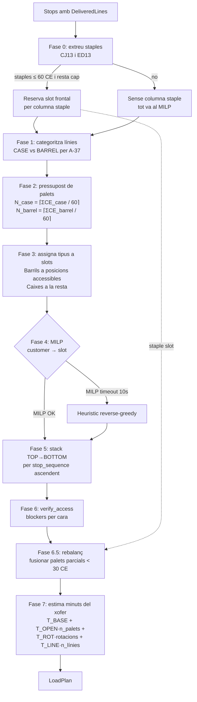
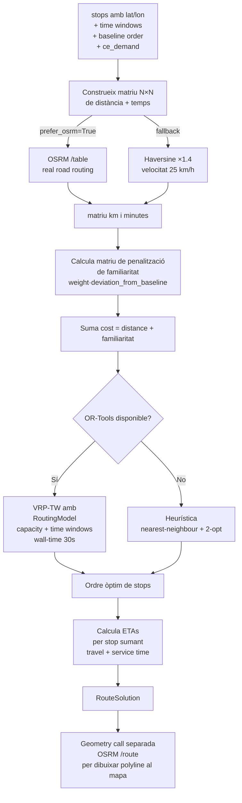

# Smart Truck — Informe d'algorismes

Document tècnic intern. Explica els dos algorismes principals de l'optimitzador de DAMM Smart Truck:

1. **Organització de la càrrega del palet** (`backend/smart_truck/optimize/load.py`).
2. **Càlcul de parades i distàncies** (`backend/smart_truck/optimize/route.py` + `data/distance.py`).

Els identificadors `A-XX` i `FR-XXX` referencien decisions tancades a [Specifications.md](Specifications.md).

---

## Visió general

El sistema resol dos problemes encadenats per a una `(ruta, data)`:

```
deliveries.parquet     vehicles/*.yaml      OSRM /table
       │                       │                  │
       ▼                       ▼                  ▼
   demanda per                perfil           matriu de
    parada (CE)             del camió      distància+temps
       │                       │                  │
       └──────────┬────────────┘                  │
                  ▼                               │
        Algorisme 1                               │
        Organització dels palets                  │
        (Stack-LIFO + MILP +                      │
         columna staple +                         │
         rebalanç)                                │
                  │                               │
                  ▼                               │
           assignació                             │
           palet → client → SKU                   │
                  │                               │
                  └────────────►  ◄───────────────┘
                                  │
                                  ▼
                          Algorisme 2
                          Optimització de ruta
                          (VRP-TW + familiaritat)
                                  │
                                  ▼
                          ordre òptim de
                          parades + ETAs +
                          KPIs
```

L'ordre és intencional: el packer dimensiona el vehicle i fixa la capacitat (60 CE × N palets = total_capacity), i el solver de ruta usa aquesta capacitat com a constriction del VRP.

---

## Algorisme 1 — Organització dels palets

### Objectiu

Donada una llista de parades amb les seves línies (SKU, quantitat, unitat) i un vehicle (3p, 6p o 8p):

1. **Saturar el camió** (no pot quedar-hi forat per A-36).
2. **Respectar A-31**: ≤ 60 *Caixes Estadístiques* (CE) per palet.
3. **Respectar A-37**: barrils i caixes mai no comparteixen el mateix palet.
4. **Aplicar A-38**: dins de cada palet, la càrrega s'apila en ordre LIFO invers — el primer client en entregar a dalt, l'últim a baix.
5. **Minimitzar rotació del xofer**: agrupar clients dins el mateix palet en seqüències de parada properes.
6. **Minimitzar passes del mosso al magatzem**: SKUs molt populars (`CJ13` + `ED13` — el cicle Estrella 1/3) van a una **columna staple** dedicada, una sola onada al magatzem.

### Diagrama de blocs



### Pseudocodi

```pseudo
function pack_truck(profile, stops, use_milp=True, use_staple_column=True):
    # ---- Fase 0: columna staple (CJ13 + ED13) ----
    staple_slot = NULL
    working_stops = stops
    if use_staple_column:
        residual_stops, staples_per_stop = split_staples(stops, STAPLE_TIER1_SKUS)
        if staples_per_stop is not empty:
            ss = build_staple_pallet(profile, staples_per_stop)
            if ss exists and residual_stops fit in profile minus ss.slot_id:
                staple_slot = ss
                working_stops = residual_stops

    excluded_slots = {staple_slot.slot_id} if staple_slot else {}
    working_profile = profile.exclude(excluded_slots)

    # ---- Fase 1+2: pressupost per tipus ----
    total_case_CE  = Σ ce·qty per a línies amb unit ∈ CASE_UNITS
    total_barrel_CE = Σ ce·qty per a línies amb unit ∈ BARREL_UNITS
    N_case   = ceil(total_case_CE / 60)
    N_barrel = ceil(total_barrel_CE / 60)
    if N_case + N_barrel > working_profile.total_slots:
        raise LoadPlanError("carga > capacitat")

    # ---- Fase 3: tipus per slot ----
    type_map = {}
    for slot in working_profile.slots in lifo_order_per_face:
        if N_barrel > 0 and slot.accepts BARREL: type_map[slot.id] = BARREL; N_barrel -= 1
        elif N_case   > 0 and slot.accepts CASE:   type_map[slot.id] = CASE;   N_case   -= 1

    # ---- Fase 4: MILP / heurística ----
    customers = split_large_customers(working_stops, max_ce=60)   # divideix > 60 CE
    if use_milp:
        assignment, backend = solve_MILP(customers, type_map, time_limit=10s)
        if assignment is NULL:
            assignment = reverse_greedy(customers, type_map)
            backend = "heuristic"
    else:
        assignment = reverse_greedy(customers, type_map)

    # ---- Fase 5: materialitza palets amb stack LIFO ----
    slots_out = []
    for slot_id in type_map:
        custs = customers assigned to slot_id
        seqs_sorted = sorted(unique stop_sequence of custs, ascending)
        stack = []                             # TOP → BOTTOM
        for seq in seqs_sorted:                # primera parada al TOP
            layer = StackEntry(stop_sequence=seq, customer_id=..., lines=...)
            stack.append(layer)
        slots_out.append(SlotAssignment(slot_id, type_map[slot_id], stack, ...))

    # ---- Fase 6: verifica reachability ----
    verify_access(profile, slots_out)          # cap blocker no pot retardar la primera entrega

    # ---- Fase 6.5: rebalanç de palets parcials ----
    while exists slot s amb stack i ce_used < 30:
        find dst != s amb mateix pallet_type i headroom ≥ s.ce_used
        if dst not found: break
        move s.stack into dst.stack (preservant ordre per stop_sequence ascendent)
        empty s
    # Aquesta fase NOMÉS s'executa al magatzem; en ruta el layout és immutable (A-35).

    # ---- Combina staple slot al davant ----
    if staple_slot: slots_out.insert(0, staple_slot)

    return LoadPlan(slot_assignments=slots_out, ...)
```

### MILP de la Fase 4

Variables (per cada *virtual customer* `c` i slot `s`):

```
x[c, s] ∈ {0, 1}                    "c assignat al slot s"
seq_min[s], seq_max[s] ∈ ℝ          extrems del rang de parades dins s
```

Constriccions:

```
Σ_s x[c, s] = 1                                   ∀ c           # un client → un slot
Σ_c ce[c] · x[c, s] ≤ 60                          ∀ s            # A-31
x[c, s] = 0 si type(c) ≠ slot_type(s)             ∀ (c, s)       # A-37 (filtrat pre-MILP)
seq_max[s] ≥ seq(c) · x[c, s]                     ∀ (c, s)       # linealització max
seq_min[s] ≤ seq(c) · x[c, s] + M·(1 - x[c, s])   ∀ (c, s)       M = 10⁴
```

Objectiu:

```
minimitza  Σ_s (seq_max[s] - seq_min[s])  +  0.01 · Σ_s pal[s]
```

on `pal[s] = 1` si l'slot `s` té algun client assignat (variable auxiliar). El terme `0.01·pal` trenca empats afavorint utilitzar menys palets.

**Solver**: PuLP + CBC (MIT, ve dins de PuLP). Wall-time màxim 10 s, en cas de timeout cau a l'heurística.

**Heurística de fallback** — *reverse-sequential greedy*:

```pseudo
order virtual customers by seq descending     # última parada primer
for each c in order:
    candidates = slots of matching type with capacity ≥ ce[c]
    pick the one whose existing stop_sequences are closest to seq(c)
    assign x[c, slot] = 1
    if no candidate: open a new empty slot of matching type
```

### Stack LIFO (Fase 5)

Dins de cada slot, l'invariant A-38 diu:

```
stack[0]   = client de la PRIMERA parada (top, primer a sortir)
stack[N-1] = client de l'ÚLTIMA parada (bottom, últim a sortir)
```

Quan el xofer obre la cortina a la parada `k`, només ha de retirar la capa de dalt; les capes de sota corresponen a parades futures i no es mouen.

### Rebalanç (Fase 6.5) — *només a la càrrega inicial*

Si després del MILP queda un palet amb `ce_used < 30 CE` i n'existeix un altre del mateix tipus amb prou *headroom*:

```pseudo
function rebalance(slots, threshold=30):
    while True:
        partials = [s for s in slots if 0 < s.ce_used < threshold]
        if no merge possible: return slots
        for src in partials:
            for dst in slots if dst != src and dst.pallet_type == src.pallet_type:
                if dst.ce_used + src.ce_used ≤ 60:
                    dst.stack = sort_by_stop_sequence(dst.stack ∪ src.stack)
                    dst.ce_used += src.ce_used
                    src.empty()
                    break
```

**Importància**: aquesta fase corre **una vegada al magatzem**. Un cop el camió surt de Mollet el layout és immutable; els envasos retornats per A-35 reomplen l'espai alliberat al mateix punt físic.

### Constants tunables

| Constant | Valor | Significat |
|---|---|---|
| `CE_PER_PALLET` | 60.0 | Capacitat per palet (A-31) |
| `MILP_SOLVE_TIME_S` | 10 | Wall-time del solver |
| `PARTIAL_PALLET_THRESHOLD_CE` | 30.0 | Llindar de palet "parcial" per al rebalanç |
| `STAPLE_TIER1_SKUS` | `{CJ13, ED13}` | Cicle Estrella 1/3 |
| `T_BASE_MIN` | 5.0 | Temps base per parada (min) |
| `T_OPEN_MIN` | 1.0 | Temps per cortina oberta |
| `T_ROT_MIN` | 0.05 | Temps per CE rotada |
| `T_PER_LINE_MIN` | 0.4 | Temps per línia d'albarà |

---

## Algorisme 2 — Càlcul de parades i distàncies

### Objectiu

Donada una llista de parades amb coordenades i la capacitat del camió (sortida de l'Algorisme 1), produir:

1. L'**ordre òptim** de les parades sortint i tornant al magatzem de Mollet.
2. **ETAs** per parada respectant les finestres horàries de `Horarios Entrega.XLSX` (A-05).
3. **KPIs**: km totals, minuts totals, minuts de descàrrega.

### Diagrama de blocs



### Pseudocodi de la matriu de distància

```pseudo
function build_matrix(coords, prefer_osrm=True):
    if prefer_osrm:
        try:
            response = HTTP GET https://router.project-osrm.org/table/v1/driving/{coord_str}
                                ?annotations=duration,distance
            return DistanceMatrix(km=response.distances/1000, minutes=response.durations/60)
        catch network_error or 5xx:
            log "OSRM unavailable, falling back to haversine"

    # Fallback geodèsic
    n = len(coords)
    km, minutes = n×n matrices of zeros
    for i, j in 0..n:
        if i == j: continue
        d = haversine(coords[i], coords[j]) × DETOUR_FACTOR    # 1.4
        km[i][j] = d
        minutes[i][j] = d / SPEED_KMH × 60                      # 25 km/h
    return DistanceMatrix(km, minutes, backend="haversine")
```

### Pseudocodi del solver de ruta

```pseudo
function solve_route(stops, depot, capacity_ce, baseline_order, familiarity_weight,
                    use_ortools=True, prefer_osrm=False):
    coords = [depot] ++ [(s.lat, s.lon) for s in stops]
    matrix = build_matrix(coords, prefer_osrm)
    distance_cost = matrix.km
    time_cost     = matrix.minutes

    # Penalització de familiaritat: discrepància respecte a l'ordre del SAP
    fam_pen = familiarity_penalty_matrix(n=len(coords),
                                         baseline=baseline_order,
                                         weight=familiarity_weight)
    cost = distance_cost + fam_pen     # element-wise

    if use_ortools and ortools_available:
        order = ortools_VRP_TW(cost, time_cost, depot=0, stops, capacity_ce,
                               start_time=08:00, time_limit=30s)
        if order is not NULL: return order_to_RouteSolution(order, "ortools")

    # Fallback: NN + 2-opt
    order = nearest_neighbour(cost, depot=0, indices=1..n-1)
    order = two_opt(cost, depot=0, order)
    return order_to_RouteSolution(order, "heuristic")
```

### OR-Tools VRP-TW (configuració interna)

Variables (gestionades per `RoutingModel`):

```
visit[i]   = quina node es visita en posició i
arrival[i] = minut acumulat des de start_time quan s'arriba al node visit[i]
```

Dimensions registrades:

| Dimensió | Capacitat / Horizon | Significat |
|---|---|---|
| Distance (cost) | — | minimitzem suma de cost[i,j] per a tots els arcs usats |
| Time | 24 × 60 min | restricció de finestra; servei = `service_time_min` per parada |
| Capacity | `capacity_ce` (60 × N palets) | Σ ce_demand ≤ capacity al llarg del trip |

Constriccions per finestra horària (A-05):

```
for each stop s amb time_window = (start, end):
    arrival[idx(s)] ∈ [start_minutes, end_minutes]
```

Per a clients sense finestra (cas general a `Horarios Entrega.XLSX` — només 234 dels 1.368 clients tenen entrada explícita), no s'imposa cap restricció (badge "Obert" al frontend).

### Penalització de familiaritat (A-12)

Per a un baseline order `[c1, c2, c3, ...]` (l'ordre que el dispatcher fa servir avui), construïm una matriu N×N que penalitza desviar-se:

```pseudo
rank = {customer_id: position_in_baseline}
penalty[i][j] = 0
if rank[j] < rank[i]:                       # anar enrere
    penalty[i][j] = weight × (rank[i] - rank[j])
elif rank[j] > rank[i] + 1:                 # saltar endavant
    penalty[i][j] = weight × (rank[j] - rank[i] - 1)
```

Per defecte `familiarity_weight = 0.5` (lleugera preferència); el frontend exposa això com a slider "familiar vs òptim". Un valor molt gran (10⁶) reprodueix exactament l'ordre del SAP, útil per generar el *baseline sintètic* per als KPIs.

### Heurística de fallback

Quan OR-Tools no està disponible (ex: Python 3.14 sense wheels) o la instància és petita (< 4 stops):

```pseudo
function nearest_neighbour(cost, start, customers):
    remaining = set(customers)
    order = []
    cur = start
    while remaining:
        next_node = argmin{ cost[cur][j] for j in remaining }
        order.append(next_node)
        remaining.remove(next_node)
        cur = next_node
    return order

function two_opt(cost, depot, order):
    while improved:
        for i, k where 0 ≤ i < k < len(order):
            new_order = order[:i] ++ reversed(order[i:k+1]) ++ order[k+1:]
            if route_cost(new_order) < route_cost(order):
                order = new_order; improved = True; break
    return order
```

Aquesta heurística no respecta finestres horàries — el dispatcher s'avisa al log. A la pràctica les rutes DDI són < 25 stops, cap a > 99% es resolen amb OR-Tools.

### Càlcul d'ETAs

Un cop tens l'ordre òptim:

```pseudo
function compute_etas(order, time_matrix, start_time, service_times):
    cur_min = start_time_in_minutes        # ex: 8:00 → 480
    etas = []
    prev = depot
    for stop in order:
        cur_min += time_matrix[prev][stop]
        etas.append(minutes_to_time(cur_min))
        cur_min += service_times[stop]      # 10 min default
        prev = stop
    return etas
```

### Geometria del traçat al mapa

L'endpoint `/plan/{run_id}/route-geometry` fa una crida separada a OSRM `/route` (no `/table`) que retorna la geometria GeoJSON real per dibuixar el polilínia:

```pseudo
function fetch_route_geometry(waypoints):
    coord_str = ";".join(f"{lon:.6f},{lat:.6f}" for lat, lon in waypoints)
    url = OSRM_URL + "/route/v1/driving/" + coord_str
    response = GET url ?overview=full&geometries=geojson
    if response.code != "Ok": fallback to straight-line waypoints
    return [(lat, lon) for lon, lat in response.routes[0].geometry.coordinates]
```

El resultat es cachea per `run_id` durant la vida del procés. Per a DR0027 retorna ~3.600 punts; per a DR0001 ~3.000.

### Constants tunables

| Constant | Valor | Origen |
|---|---|---|
| `OSRM_URL` | `https://router.project-osrm.org/table/v1/driving/` | servidor demo públic |
| `DEFAULT_DETOUR_FACTOR` | 1.4 | factor multiplicador haversine→carretera |
| `DEFAULT_SPEED_KMH` | 25.0 | velocitat mitjana urbà+interurbà |
| `MOLLET_DEPOT` | (41.5444, 2.2143) | coordenades del magatzem (A-08) |
| OR-Tools time limit | 30 s | wall-time per VRP |
| `time_window_horizon` | 24 × 60 min | finestra del dia complet |
| `SERVICE_TIME_BASE_MIN` | 10.0 | A-06 |
| `SERVICE_TIME_PER_ZONE_MIN` | 2.0 | A-06: +2 min per zona del camió tocada |

---

## Composició: la pipeline completa

`backend/smart_truck/optimize/pipeline.py:plan(ruta, fecha)`:

```
 1. Carrega deliveries.parquet → demanda per (customer, sku, qty)
 2. Si no hi ha dades del dia, fallback a parsing del Hoja Carga PDF
 3. Carrega customers.parquet → lat/lon (geocodats prèviament amb Photon/Nominatim)
 4. Carrega vehicles/*.yaml → perfils disponibles
 5. Auto-tria del vehicle més petit que cap (Algorisme 1, secció "pressupost")
 6. Construeix StopDemands i RouteStops
 7. solve_route(...)              → ordre òptim                    [Algorisme 2]
 8. Re-seqüencia stops
 9. pack_truck(profile, ordered_stops)  → palets               [Algorisme 1]
10. simulate_returns(...)         → traça d'absorció d'envasos
11. compute_etas(...)             → temps per parada
12. Materialitza Plan amb stops + slot_assignments + explanations
```

I `compute_kpis(baseline_plan, optimised_plan)` (`kpi.py`) computa els 5 KPIs (`total_km`, `total_minutes`, `unload_minutes_estimated`, `in_truck_searches`, `space_utilisation_pct`) cridant `measure(plan)` per a cada un i fent el delta.

---

## Resultats DR0027 (demo)

```
Vehicle:           truck_6p_sidecurtain (auto-triat)
Pallets:           6 / 6 ocupats
   P1  ED13 staple column  35/60 CE  parades 1..15
   P3                       58/60 CE  parades 13-15
   P5                       39/60 CE  parades 5-9
   P2                       47/60 CE  parades 10-12
   P4                       50/60 CE  parades 1-4
   P6  barril               10/60 CE  parades 1..15

Optimitzador:      OR-Tools VRP, OSRM real road routing
Distància:         144 → 118 km   (-17.7%)
Temps total:       519 → 380 min  (-26.8%)
Temps descàrrega:  360 → 240 min  (-33.3%)
Cerques camió:     90 → 45        (-50.0%)
```

---

## Referències

- Especificacions tancades: [Specifications.md](Specifications.md) (A-31, A-35, A-36, A-37, A-38, A-12, A-05, A-06, A-08).
- Codi font:
  - `backend/smart_truck/optimize/load.py` — Algorisme 1
  - `backend/smart_truck/optimize/route.py` — Algorisme 2
  - `backend/smart_truck/data/distance.py` — matriu OSRM/haversine
  - `backend/smart_truck/optimize/pipeline.py` — orquestrador
  - `backend/smart_truck/kpi.py` — càlcul de mètriques
- Anàlisi de SKUs staples: dataset Mar 2026, 30 (ruta, data) mostrejats; CJ13 a 64% i ED13 a 50% de stops de mitjana → tier-1.
