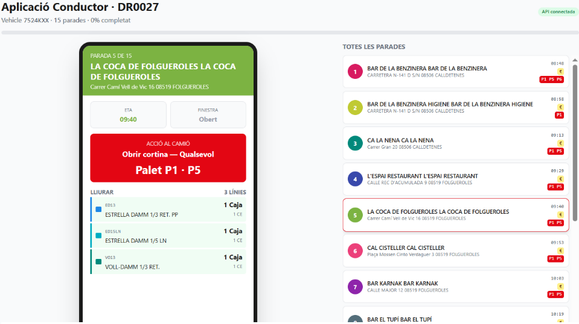

<!-- _class: cover -->
<!-- _paginate: false -->
<!-- _footer: '' -->

<div class="meta">PELOTA BRAVA · INTERHACK BCN 2026</div>

# Smart **Truck**

<div class="tagline">
Mateix recorregut. Camió impecable.<br/>
Optimització conjunta de ruta i càrrega per a DDI Mollet.
</div>

<div class="meta-bottom">EQUIP PELOTA BRAVA · REPTE DAMM DDI</div>

<!--
0:00 (10s) — Hola, som Pelota Brava i us presentem Smart Truck.
La idea: optimitzar conjuntament ruta i càrrega del camió DDI sense
canviar el SAP.
-->

---

<div class="eyebrow">Context · 1 de 7</div>

# El conflicte que Damm ja anomena

<div class="cols">
<div>

### Magatzem · Mosso

- Carrega **per Ubicació** lex
- Recorregut curt pels passadissos
- Eficient al magatzem

</div>
<div class="col-rule">

### Camió · Xofer

- Descàrrega **per parada** LIFO
- Zero rotació entre parades
- Eficient al repartiment

</div>
</div>

<br/>

> *DAMM ho diu al seu deck: NO és Google Maps + Tetris. **És un sistema de suport a la decisió** que reconcilia magatzem, repartiment i logística inversa.*

<!--
0:10 (25s) — El conflicte real: el magatzem vol carregar per ubicació,
el xofer vol descarregar per parada. Damm mateix ho escriu al seu
deck — no és google maps + tetris. Smart Truck reconcilia els dos.
-->

---


<div class="eyebrow">Solució · 2 de 7 · Full de Càrrega</div>

# La columna **Descàrrega**

El SAP de DDIDGP **ja imprimeix aquesta columna** a la Hoja Carga, però sempre buida.

**Smart Truck l'omple** amb el slot òptim del camió per a cada línia.

**Adopció ≈ zero** — mateix paper, mateix mosso, mateix xofer.

<!--
0:35 (30s) — La nostra intervenció és única: la columna Descàrrega
del SAP que sempre surt buida. Smart Truck la calcula i l'omple amb
el slot del camió. Adopció pràcticament zero perquè no canviem el
paper, només l'omplim. La pestanya Full de Càrrega de la nostra app
ho ensenya en directe — toggle entre "Original" (buida) i "Smart"
(plena).
-->

---


<div class="eyebrow">Demo · 3 de 7 · Tauler</div>

# Ruta optimitzada

- 15 parades reals d'**Osona**
- VRP-TW amb **OR-Tools** + matriu **OSRM** real
- Polilínia que segueix la C-25 i N-141
- Familiarity bias soft envers l'ordre del SAP

<!--
1:05 (20s) — Demo. Tauler. 15 parades reals, ruta calculada amb
OR-Tools sobre matriu OSRM (carreteres reals, no haversine). Click
a una parada i veus els productes que rep.
-->

---


<div class="eyebrow">Demo · 4 de 7 · Magatzem</div>

# Càrrega 3D animada

- Cada **pas = una Ubicació** (lex order del magatzem)
- Una **onada** distribueix entre múltiples palets
- **Caixes** com cubs · **Barrils** com cilindres
- Color **per producte** · cross-reference llista ↔ palet

<!--
1:25 (25s) — Magatzem. El mosso fa el recorregut de sempre per
ubicació. Smart Truck reparteix cada onada entre els palets del
camió. Caixes i barrils discrets, animació pas a pas.
-->

---


<div class="eyebrow">Demo · 5 de 7 · Camió</div>

# Distribució òptima

- **P1** staple · Estrella 1/3 a totes 15 parades
- **P3 / P5** clústers LIFO · 5-7 parades cadascun
- **P6** barrils · només a parades amb barril real
- Sense rotacions entre parades adjacents

<!--
1:50 (25s) — Camió. P1 columna staple Estrella 1/3 — el cicle
universal, totes les parades en reben. P3 i P5 clústers LIFO, cada
un per a un grup de parades consecutives. P6 barrils, només per a
les parades que en demanen — el xofer no obre P6 a totes les
parades.
-->

---



<div class="eyebrow">Demo · 6 de 7 · Conductor</div>

# App mòbil funcional

- Pantalla per cada parada · navegació prev / next
- **Cortina** + **palet** + ítems integers
- ETA · finestra · CONTADO / CRÈDIT
- "Confirmar lliurament" → salta a la pròxima

<!--
2:15 (20s) — Conductor. App de mòbil amb pantalla per parada. Botó
vermell "Confirmar lliurament" que avança al següent. Llista lateral
amb totes les parades + progrés.
-->

---

<div class="eyebrow">Anàlisi · 7 de 7</div>

# Coeficient global d'optimització

```
C_ruta      = ½ ( ΔKM + ΔT_viatge )            ← pèrdua a la carretera
C_muntatge  = (W_baseline − W_proposat) / W_b   ← espai de palet (W = malbarat)
C_conductor = ½ ( ΔCerques + ΔT_descàrrega )   ← pèrdua a parades

K = w_r·C_ruta + w_m·C_muntatge + w_d·C_conductor      tots ∈ [0, 1]
```

<div class="cols">
<div>

### Pipeline algorítmica

- **Stack-LIFO + MILP** (PuLP/CBC)
- **Columna staple** (cicle Estrella)
- **VRP-TW + OR-Tools** + OSRM real
- Pesos `w_r/w_m/w_d` calibrables

</div>
<div class="col-rule">

### Per què en producte

- Els tres coeficients **no són independents**
- Una caiguda forta en un penalitza K
- Equival a "**3 pèrdues han d'anar bé alhora**"
- Eina d'avaluació ↔ comparació entre alternatives

</div>
</div>

<!--
2:35 (35s) — Anàlisi. Definim 3 coeficients en [0,1] que mesuren la
fracció de pèrdua eliminada en cada procés: ruta, muntatge i
conductor. El producte ponderat K dóna una mètrica única
comparable. Pesos calibrables segons priories Damm. La pipeline
algorítmica encadena packer Stack-LIFO + MILP amb el VRP-TW d'OR-
Tools, alimentat amb dades reals de Mollet i OSRM real-road.
-->

---

<!-- _class: closing -->
<!-- _paginate: false -->
<!-- _footer: '' -->
<!-- _backgroundColor: '#1A1A1A' -->
<!-- _color: '#ffffff' -->

# Smart **Truck**

<div class="tagline">
La columna Descàrrega ja no surt en blanc.
</div>

<br/>

Mateix paper · Mateixa adopció · **Tres pèrdues alhora reduïdes**.

<div class="meta">PELOTA BRAVA · INTERHACK BCN 2026 · gràcies</div>

<!--
3:10 (10s) — Tancament. Mateix paper, adopció zero, tres tipus de
pèrdua reduïdes alhora. Gràcies. Preguntes.
-->
